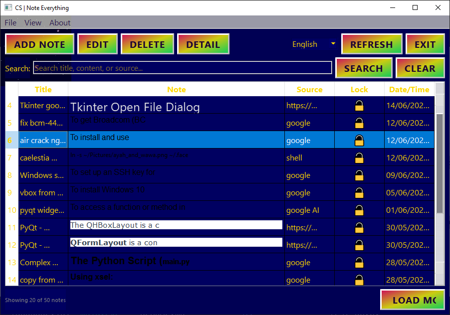
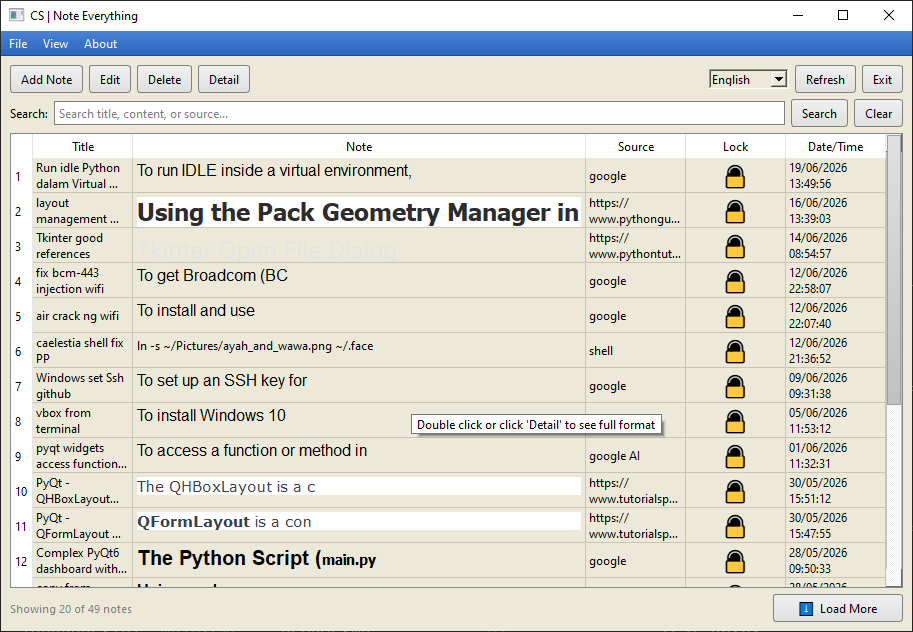
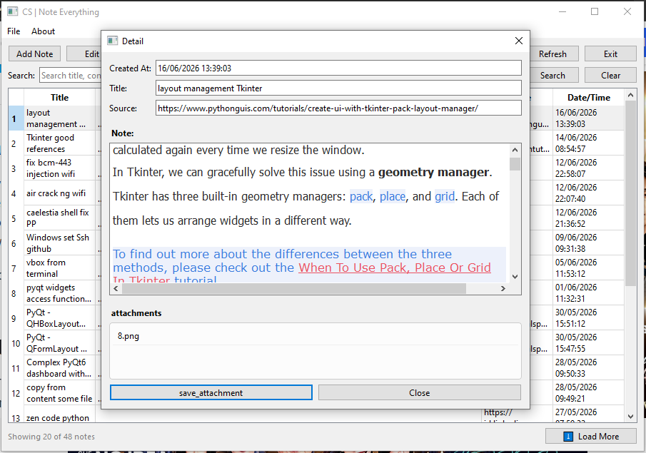
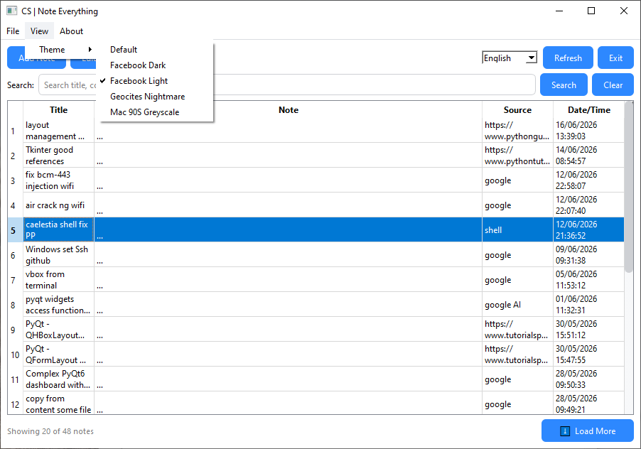
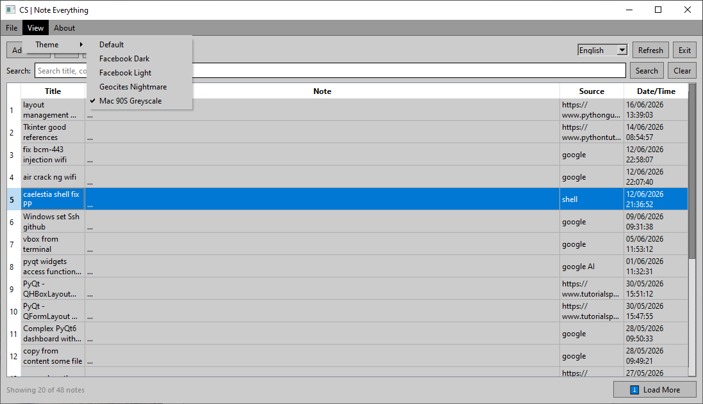
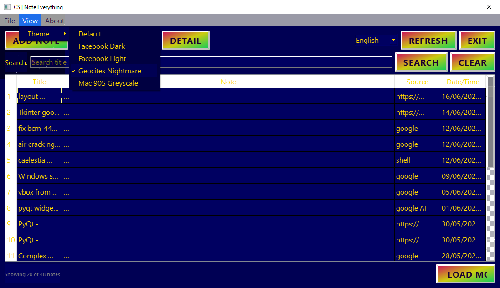
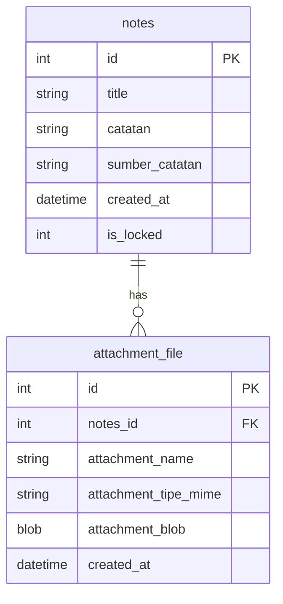

# python-ui-notes-app

this app inspired from my need for quick save note and search note



this app use sqlite3 as database for easy to stand alone app

## how to run

make sure you have python 3.13 or higher and create virtual environment and install requirements with `pip install -r requirements.txt`

then run the app with `python -m main`




## Screenshots

| Screenshot | Description |
|-----------|-------------|
|  | Main interface showing the notes table with pagination and language selector. Users can browse notes with the "Load More" button to fetch additional records. The top toolbar includes add, edit, delete, detail, and refresh buttons for note management. |
|  | Theme selection menu from the View menu. The application supports multiple theme styles that can be customized. Once selected, the chosen theme is persisted in QSettings and automatically applied on the next app launch. |
|  | Add/Edit note dialog with rich text editor. Users can enter a note title, compose notes with HTML formatting support, add a source reference, and attach files. The dialog integrates with the custom QTextEdit widget that supports clipboard image pasting. |

## running tests

The application contains two test suites:

- `test_db.py`: Tests the SQLite database CRUD queries and cascading deletions.
- `test_app.py`: Tests database integration, config translation dictionaries, and PySide6 Qt UI dialogs (NoteDialog, NoteDetailDialog, MainWindow).

### Headless Execution (Recommended)

Because PySide6 Qt widgets require a graphic display system by default, you can configure them to run headlessly (without GUI windows popping up) using the `offscreen` platform plugin:

#### Linux & macOS

```bash
QT_QPA_PLATFORM=offscreen python3 test_app.py
```

#### Windows (Command Prompt)

```cmd
set QT_QPA_PLATFORM=offscreen
python test_app.py
```

#### Windows (PowerShell)

```powershell
$env:QT_QPA_PLATFORM="offscreen"
python test_app.py
```

### Visual Execution

If you are in a GUI-enabled desktop environment and want to watch the windows dynamically initialize and close during test execution, you can run:

```bash
python3 test_app.py
```

## project structure

The project is organized in a modular structure to separate core database operations, translation configurations, custom UI widgets, dialog windows, and the main window UI controller:

```
python-ui-notes-app/
├── main.py                     # Entry point (initializes QApplication and displays MainWindow)
├── database.py                 # Core database manager (DatabaseManager queries)
├── language.ini                # Translations configuration
├── requirements.txt            # Project dependencies
├── Catat-Segala.spec           # PyInstaller spec configuration
└── src/                        # main source package
    ├── config.py               # Config & translation dictionary helper
    ├── widgets/
    │   └── custom_text_edit.py # Custom QTextEdit widget supporting clipboard image pasting
    ├── dialogs/
    │   └── note_dialogs.py     # Note add/edit and detail view dialog classes
    └── ui/
        └── main_window.py      # MainWindow UI design and controller class
```

## Database Schema & Relations

The application uses SQLite3 to store notes and their associated files. The database consists of two tables with a **one-to-many (1:N)** relationship:



### Tables

1. **`notes` Table**:
   - `id` (INTEGER PRIMARY KEY AUTOINCREMENT) - Unique identifier for each note.
   - `title` (TEXT NOT NULL) - Note title.
   - `catatan` (TEXT NOT NULL) - Note content (supports HTML/rich text).
   - `sumber_catatan` (TEXT) - Optional source/reference.
   - `created_at` (DATETIME DEFAULT CURRENT_TIMESTAMP) - Date/time created.
   - `is_locked` (INTEGER DEFAULT 0) - Lock flag. When `1`, the Note and Source columns are hidden in the table UI and replaced with a lock icon (🔒).

2. **`attachment_file` Table**:
   - `id` (INTEGER PRIMARY KEY AUTOINCREMENT) - Unique identifier for each attachment.
   - `notes_id` (INTEGER NOT NULL) - Foreign Key linking to `notes(id)`.
   - `attachment_name` (TEXT NOT NULL) - Name of the attached file.
   - `attachment_tipe_mime` (TEXT NOT NULL) - File type (MIME Type, e.g., `text/plain`, `image/jpeg`, `application/pdf`).
   - `attachment_blob` (BLOB NOT NULL) - Binary file data stored directly in the database.
   - `created_at` (DATETIME DEFAULT CURRENT_TIMESTAMP) - Date/time uploaded.

### Relationships and Integrity

- **Enforced Foreign Keys**: Every connection dynamically executes `PRAGMA foreign_keys = ON;` to maintain relational integrity.
- **Cascade Deletion (`ON DELETE CASCADE`)**: Deleting a note automatically cascades to delete all related records in `attachment_file`, preventing orphaned files and database bloat.

## features

1. create note show window dialog for new notes
2. read note show list of notes in table
3. update note show window dialog for update notes
4. delete note show window dialog for delete notes
5. search note show list of notes in table with search input
6. detail note with double click at current row show window dialog
7. refresh note show list of notes in table with refresh button
8. support html in catatan field, and you can paste from some web example
9. export note to csv
10. backup database Sqlite3 format
11. language switcher with ini file as dictionary
12. paginated list loading with "Load More" button to keep performance optimal
13. text editor support for pasting images directly from the clipboard (embedded as base64 HTML)
14. support for note attachments (add, delete, and download any file type on add/edit and detail windows)
15. dynamic UI themes support from `.qss` style files in the `src/themes` directory
16. note locking — toggle lock on add/edit to hide Note and Source columns in the table with a 🔒 indicator; title and date remain visible for quick identification

## pyinstaller

if you want to make it standalone app you can use pyinstaller
make sure you have pyinstaller installed with `pip install pyinstaller`

To compile the application along with the dynamic UI themes correctly, you must include the `src/themes` directory using the `--add-data` flag:

**Linux / macOS:**
```bash
pyinstaller --onefile --windowed --add-data "src/themes:src/themes" main.py
```

**Windows:**
```cmd
pyinstaller --onefile --windowed --add-data "src/themes;src/themes" main.py
```

see pyinstaller doc for more info <https://pyinstaller.readthedocs.io/en/stable/> and <https://pyinstaller.readthedocs.io/en/stable/usage.html> for more info about pyinstaller usage  

### TODO

1. ~~add image upload if needed~~
2. ~~add lock feature for some screet notes, example like password or screet api key an token~~
3. ~~add export and import feature or backup and restore feature~~

## license

this app is open source and free to use and modify

## author

sm-alfariz
<https://github.com/sm-alfariz>
