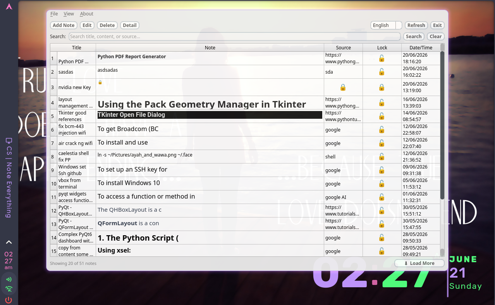
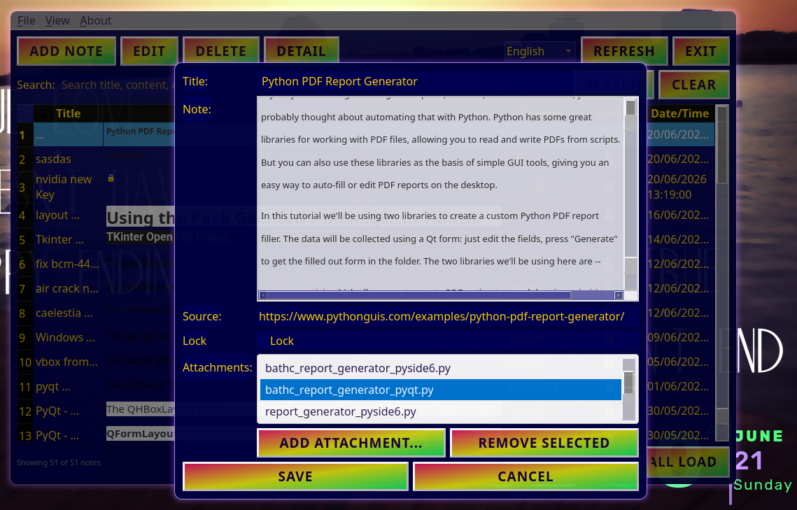
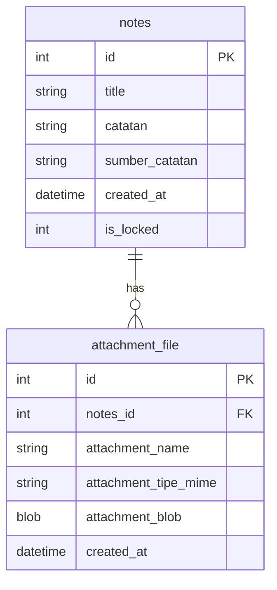

# Python UI Notes App

This app was inspired by my need to quickly save and search notes.


This app uses SQLite3 as the database for an easy standalone app experience.

## how to run

Make sure you have Python 3.13 or higher. Create a virtual environment and install requirements with `pip install -r requirements.txt`.

Then run the app with `python -m main`.


## Screenshots

| Screenshot | Description |
|-----------|-------------|
|  | Main interface showing the notes table with pagination and language selector. Users can browse notes with the "Load More" button to fetch additional records. The top toolbar includes add, edit, delete, detail, and refresh buttons for note management. |
|  | Theme selection menu from the View menu. The application supports multiple theme styles that can be customized. Once selected, the chosen theme is persisted in QSettings and automatically applied on the next app launch. |
|  | Add/Edit note dialog with rich text editor. Users can enter a note title, compose notes with HTML formatting support, add a source reference, and attach files. The dialog integrates with the custom QTextEdit widget that supports clipboard image pasting. |
|  | Running in a Linux Wayland environment |
|  | Running in a Linux Wayland environment with another theme |

## running tests

The application contains two test suites:

- `test_db.py`: Tests the SQLite database CRUD queries and cascading deletions.
- `test_app.py`: Tests database integration, config translation dictionaries, and PySide6 Qt UI dialogs (NoteDialog, NoteDetailDialog, MainWindow).

### Headless Execution (Recommended)

Because PySide6 Qt widgets require a graphic display system by default, you can configure them to run headlessly (without GUI windows popping up) using the `offscreen` platform plugin:

#### Linux & macOS

```bash
QT_QPA_PLATFORM=offscreen python3 test_app.py
```

#### Windows (Command Prompt)

```cmd
set QT_QPA_PLATFORM=offscreen
python test_app.py
```

#### Windows (PowerShell)

```powershell
$env:QT_QPA_PLATFORM="offscreen"
python test_app.py
```

### Visual Execution

If you are in a GUI-enabled desktop environment and want to watch the windows dynamically initialize and close during test execution, you can run:

```bash
python3 test_app.py
```

## project structure

The project is organized in a modular structure with mixins for separation of concerns, delegates for custom rendering, and utility modules:

```
python-ui-mysql/
├── main.py                     # Entry point — initializes QApplication and shows MainWindow
├── database.py                 # Core database manager (SQLite CRUD queries, pagination, attachments)
├── language.ini                # Translation keys (English, Indonesian, etc.)
├── requirements.txt            # Python dependencies
├── Catat-Segala.spec           # PyInstaller spec for building standalone executable
├── test_app.py                 # Unit tests (database, config, Qt UI dialogs)
├── test_blackbox.py            # Blackbox / integration tests
├── assets/                     # Application icons and images
│   ├── logo.png                #   App window icon
│   ├── appicon.png / .svg      #   App launcher icon
│   ├── new-notes.png           #   Context menu icon
│   ├── edit-notes.png          #   Context menu icon
│   ├── delete-notes.png        #   Context menu icon
│   ├── detail-notes.png        #   Context menu icon
│   ├── export-html.png         #   Context menu icon
│   ├── export-pdf.png          #   Context menu icon
│   ├── lock.png                #   Lock action icon
│   └── unlock.png              #   Unlock action icon
├── screen-shoots/              # App screenshots for README
│   ├── sc-01.png ... sc-08.png
│
└── src/                        # Main source package
    ├── __init__.py
    ├── config.py               # Config constants & translation dictionary helper (t())
    │
    ├── dialogs/                # Dialog windows
    │   ├── __init__.py
    │   └── note_dialogs.py     # NoteDialog (add/edit) & NoteDetailDialog (view detail)
    │
    ├── themes/                 # QSS theme stylesheets
    │   ├── default.qss
    │   ├── facebook_dark.qss
    │   ├── facebook_light.qss
    │   ├── geocites_nightmare.qss
    │   └── mac_90s_greyscale.qss
    │
    ├── ui/                     # UI layer
    │   ├── __init__.py
    │   ├── main_window.py      # MainWindow — top-level window, toolbar, menu, search, pagination
    │   ├── theme_manager.py    # ThemeManager — loads .qss themes, applies/saves theme selection
    │   │
    │   ├── mixins/             # Reusable behavior mixed into MainWindow
    │   │   ├── __init__.py
    │   │   ├── table_management_mixin.py   # Table display, pagination, right-click context menu
    │   │   ├── note_operations_mixin.py    # Add, edit, delete, lock/unlock, detail note operations
    │   │   └── export_import_mixin.py      # CSV export, HTML/PDF export, database backup/restore
    │   │
    │   ├── delegates/          # Custom Qt delegates
    │   │   ├── __init__.py
    │   │   └── html_delegate.py            # HTML delegate for rendering rich text in table cells
    │   │
    │   └── utils/              # Small helper modules
    │       ├── __init__.py
    │       ├── string_utils.py             # strip_html(), build_snippet_html()
    │       └── date_utils.py              # format_date()
    │
    └── widgets/                # Custom Qt widgets
        ├── __init__.py
        └── custom_text_edit.py # QTextEdit subclass with clipboard image paste support
```

### Architecture overview

The codebase was refactored from a monolithic ~1100-line `main_window.py` into a modular structure using **mixins** (reusable behavior classes), **delegates** (custom Qt rendering), and **utility modules** for clear separation of concerns.

```
                       ┌─────────────────────────────┐
                       │         main.py              │
                       │  QApplication + MainWindow   │
                       └──────────────┬──────────────┘
                                      │
                       ┌──────────────▼──────────────┐
                       │      MainWindow              │
                       │  (src/ui/main_window.py)     │
                       │  Inherits from QMainWindow   │
                       └──┬───────┬───────┬───────┬──┘
                          │       │       │       │
               ┌──────────┘       │       │       └──────────┐
               │                  │       │                  │
   ┌───────────▼────────┐ ┌──────▼──────┐ ┌────────────────▼────────┐
   │ TableManagement     │ │  NoteOps    │ │  ExportImportMixin      │
   │ Mixin               │ │  Mixin      │ │                         │
   │ • display_notes()   │ │ • add_note()│ │ • export_to_csv()       │
   │ • load_more()       │ │ • edit()    │ │ • export_as_html()      │
   │ • context_menu()    │ │ • delete()  │ │ • export_as_pdf()       │
   │ • pagination        │ │ • lock()    │ │ • backup/restore DB     │
   └─────────────────────┘ └─────────────┘ └─────────────────────────┘
```

- **`main.py`** — entry point. Creates `QApplication`, sets the window icon, instantiates `MainWindow`, and runs the Qt event loop.
- **`database.py`** — `DatabaseManager` handles all SQLite operations: CRUD for notes, paginated queries, attachment management, and backup/restore.
- **`language.ini`** — translation keys in INI format (English, Indonesian, etc.), loaded into `TRANSLATIONS` dict by `config.py`.
- **`src/config.py`** — stores `TRANSLATIONS` dict (loaded from `language.ini`) and a `t(key)` translation helper used throughout the UI.

#### `src/ui/main_window.py` — MainWindow (central controller)

The `MainWindow` class inherits from `QMainWindow` and three **mixins**. It is responsible for:

| Method group | Purpose |
|---|---|
| `_init_core_attributes()` | Initialize database, language, settings, pagination state |
| `_setup_window()` | Set window properties (title, size, icon) |
| `_setup_central_widget()` | Build the full main UI layout |
| `_create_toolbar()` | Action buttons (add, edit, delete, detail, refresh) and language selector |
| `_create_search_bar()` | Search input and clear button |
| `_create_table_widget()` | Notes table with custom `HTMLDelegate` on content column |
| `_create_pagination_footer()` | Status label and "Load More" button |
| `_create_menu_bar()` | File, View, About menus |
| `t(key)` | Translation helper (reads from `TRANSLATIONS`) |
| `_retranslate_ui()` | Update all UI text when language changes |

#### `src/ui/mixins/` — behavior mixins

Each mixin handles one responsibility. `MainWindow` inherits from all three:

| Mixin | Purpose | Key methods |
|---|---|---|
| **`table_management_mixin.py`** | Table display, pagination, right-click context menu | `display_notes()`, `load_more_notes()`, `show_context_menu()`, `_populate_table_row()` |
| **`note_operations_mixin.py`** | Create, read, update, delete, lock/unlock notes | `add_note()`, `edit_note()`, `delete_note()`, `view_detail()`, `toggle_lock()` |
| **`export_import_mixin.py`** | CSV/HTML/PDF export, database backup/restore | `export_to_csv()`, `export_note_as_html()`, `export_note_as_pdf()`, `backup_notes()`, `restore_database()` |

#### `src/ui/theme_manager.py` — theme management

`ThemeManager` loads `.qss` stylesheets from `src/themes/`, applies them to the app, and persists the user's choice in `QSettings`:

| Method | Purpose |
|---|---|
| `get_saved_theme()` | Retrieve saved theme from settings |
| `save_theme(filename)` | Persist theme selection |
| `apply_theme(qss_path)` | Apply QSS stylesheet to the application |
| `populate_theme_menu()` | Build theme submenu in the View menu |

#### `src/ui/delegates/` — custom Qt delegates

| Module | Purpose |
|---|---|
| `html_delegate.py` | `HTMLDelegate` renders HTML content inside `QTableWidget` cells using `QTextDocument`. Handles selection highlighting and dynamic row sizing. |

#### `src/ui/utils/` — small helper modules

| Module | Functions | Purpose |
|---|---|---|
| `string_utils.py` | `strip_html()`, `build_snippet_html()` | Remove HTML tags, extract formatted snippets for table preview |
| `date_utils.py` | `format_date()` | Convert `"YYYY-MM-DD HH:MM:SS"` → `"DD/MM/YYYY HH:MM:SS"` |

#### `src/dialogs/` — dialog windows

| Module | Classes | Purpose |
|---|---|---|
| `note_dialogs.py` | `NoteDialog` | Add/edit dialog with rich text editor, attachment support, and clipboard image paste |
| | `NoteDetailDialog` | Read-only detail view of a note with metadata and attachments |

#### `src/widgets/` — custom Qt widgets

| Module | Class | Purpose |
|---|---|---|
| `custom_text_edit.py` | `CustomTextEdit` | Extends `QTextEdit` to support pasting images directly from the clipboard (embedded as base64 HTML) |

#### `src/themes/` — QSS stylesheets

| File | Style |
|---|---|
| `default.qss` | Default theme |
| `facebook_dark.qss` | Facebook-inspired dark theme |
| `facebook_light.qss` | Facebook-inspired light theme |
| `geocites_nightmare.qss` | Retro Geocities-inspired theme |
| `mac_90s_greyscale.qss` | 90s Mac greyscale theme |

#### `assets/` — icons

Icons used in the toolbar and right-click context menu:

| Icon | Used for |
|---|---|
| `logo.png` | App window icon |
| `appicon.png` / `appicon.svg` | App launcher icon |
| `new-notes.png` | New note action |
| `edit-notes.png` | Edit note context menu |
| `delete-notes.png` | Delete note context menu |
| `detail-notes.png` | View detail context menu |
| `export-html.png` | Export as HTML context menu |
| `export-pdf.png` | Export as PDF context menu |
| `lock.png` | Lock note action |
| `unlock.png` | Unlock note action |

## Database Schema & Relations

The application uses SQLite3 to store notes and their associated files. The database consists of two tables with a **one-to-many (1:N)** relationship:



### Tables

1. **`notes` Table**:
   - `id` (INTEGER PRIMARY KEY AUTOINCREMENT) - Unique identifier for each note.
   - `title` (TEXT NOT NULL) - Note title.
   - `catatan` (TEXT NOT NULL) - Note content (supports HTML/rich text).
   - `sumber_catatan` (TEXT) - Optional source/reference.
   - `created_at` (DATETIME DEFAULT CURRENT_TIMESTAMP) - Date/time created.
   - `is_locked` (INTEGER DEFAULT 0) - Lock flag. When `1`, the Note and Source columns are hidden in the table UI and replaced with a lock icon (🔒).

2. **`attachment_file` Table**:
   - `id` (INTEGER PRIMARY KEY AUTOINCREMENT) - Unique identifier for each attachment.
   - `notes_id` (INTEGER NOT NULL) - Foreign Key linking to `notes(id)`.
   - `attachment_name` (TEXT NOT NULL) - Name of the attached file.
   - `attachment_tipe_mime` (TEXT NOT NULL) - File type (MIME Type, e.g., `text/plain`, `image/jpeg`, `application/pdf`).
   - `attachment_blob` (BLOB NOT NULL) - Binary file data stored directly in the database.
   - `created_at` (DATETIME DEFAULT CURRENT_TIMESTAMP) - Date/time uploaded.

### Relationships and Integrity

- **Enforced Foreign Keys**: Every connection dynamically executes `PRAGMA foreign_keys = ON;` to maintain relational integrity.
- **Cascade Deletion (`ON DELETE CASCADE`)**: Deleting a note automatically cascades to delete all related records in `attachment_file`, preventing orphaned files and database bloat.

## features

1. create note show window dialog for new notes
2. read note show list of notes in table
3. update note show window dialog for update notes
4. delete note show window dialog for delete notes
5. search note show list of notes in table with search input
6. detail note with double click at current row show window dialog
7. refresh note show list of notes in table with refresh button
8. support html in catatan field, and you can paste from some web example
9. export note to csv
10. backup database Sqlite3 format
11. restore database from backup file
12. export individual notes as HTML (full standalone document with metadata)
13. export individual notes as PDF (renders rich text with consistent fonts)
14. language switcher with ini file as dictionary
15. paginated list loading with "Load More" button to keep performance optimal
16. text editor support for pasting images directly from the clipboard (embedded as base64 HTML)
17. support for note attachments (add, delete, and download any file type on add/edit and detail windows)
18. dynamic UI themes support from `.qss` style files in the `src/themes` directory
19. note locking — toggle lock on add/edit to hide Note and Source columns in the table with a 🔒 indicator; title and date remain visible for quick identification
20. multi-select delete — hold Ctrl+Click or Shift+Click to select multiple rows, then delete them all at once with a single confirmation

## pyinstaller

if you want to make it standalone app you can use pyinstaller
make sure you have pyinstaller installed with `pip install pyinstaller`

To compile the application along with the dynamic UI themes correctly, you must include the `src/themes` directory using the `--add-data` flag:

**Linux / macOS:**
```bash
pyinstaller --onefile --windowed --add-data "src/themes:src/themes" main.py
```

**Windows:**
```cmd
pyinstaller --onefile --windowed --add-data "src/themes;src/themes" main.py
```

see pyinstaller doc for more info <https://pyinstaller.readthedocs.io/en/stable/> and <https://pyinstaller.readthedocs.io/en/stable/usage.html> for more info about pyinstaller usage  

### TODO

1. ~~add image upload if needed~~
2. ~~add lock feature for some screet notes, example like password or screet api key an token~~
3. ~~add export and import feature or backup and restore feature~~
4. ~~add HTML and PDF export for individual notes~~
5. ~~user can multiple delete at once with confirmation~~
6. user can self formating text note eg. bold set header or set italic text
7. user can resize image size after paste

## License

MIT License

This app is open source and free to use and modify.

## author

sm-alfariz
<https://github.com/sm-alfariz>
